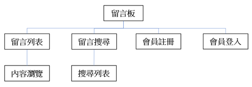
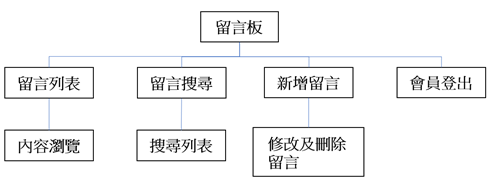

# [專案功能說明]
1. 包含留言C.R.U.D功能。
2. 包含會員註冊功能。
3. 設置權限設定，如：會員只能修改自己的留言。 
4. 留言上傳圖片檔案功能。

**未登入時系統功能架構** 

**登入時系統功能架構**  

# [專案架構]
1. 使用ASP.NET MVC架構進行撰寫。
2. 資料庫使用MSSQL。使用 ADO.NET 並通過Store Procedure進行資料庫存取。
3. 前端頁面使用基礎 HTML、CSS、JavaScript來完成版面。

# [Schema規劃]

